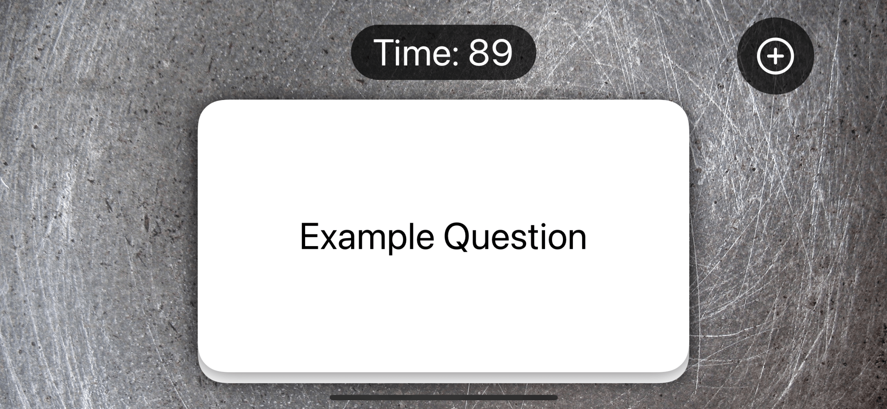
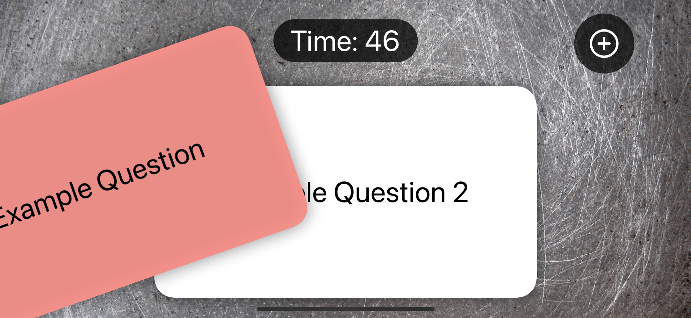
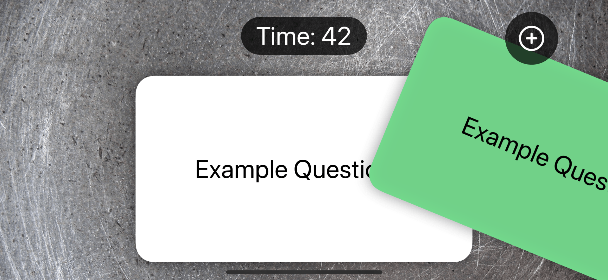

## Flashzilla

#### Description:

Flashzilla is an app I built while following [100 Days of SwiftUI](https://www.hackingwithswift.com/100/swiftui) by [Paul Hudson](https://www.twitter.com/twostraws).

It allows the user to learn things using the flashcards method. It's based on swipes and includes accesibility features.

#### Screenshots:

<section align="left">

&nbsp;

&nbsp;

</section>

## Installation and Setup Instructions

#### Prerequisites

    ⚠️ MacOS Monterey

    ⚠️ Xcode 13

#### Instructions:

    1️⃣ Clone this repository.

    2️⃣ Run it in Xcode.

## Reflection

#### Summary

    ➡️ Used gestures to drag cards around the screen
    ➡️ When offset width exceeds a certain amount, excuted code
    ➡️ Added accesibility features to make sure the app works well with voice over and differentiate without color enabled
    ➡️ Used allowHitTesting to prevent unwanted interaction
    ➡️ Used scenePhase to execute code when app is or is not active
    ➡️ Used Timer to show the user how much time he has left

#### Conclusion

Finishing this app is great, but it doesn't feel as good as finishing the last one. I still feel like I learned and practiced alot, and the app is useful and functional, but for some reason I think I've come to expect myself to be able to build an app like this. There was not much challenge at all. I suppose this will continue for the last projects, so right now I'm looking forward to finishing the course and moving on to more complex projects of my own.

Furthermore, I feel like there's not enough focus on using architecture concepts and code splitting best practices. Everything was dumped in as few views as possible, probably to keep things simple. But we've learned MVVM earlier, and it's not a central part of this project, which surprised me. I guess Paul intended for us to do these things ourselves, but these practice apps do no excite me and they will remain like this as I'm not interested in improving them.
